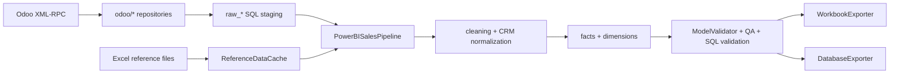

# Technical Documentation

## Architecture

## Module And Function Map

- `sales_pipeline.main`: CLI parsing, logging, optional profiler.
- `sales_pipeline.pipeline.PowerBISalesPipeline`: orchestration; `run`, `transform`, `transform_crm`, incremental sync, validation, final summary.
- `sales_pipeline.odoo`: XML-RPC client and model repositories.
- `sales_pipeline.staging.StagingStore`: raw-table replace/upsert/date-window replacement and indexes.
- `sales_pipeline.legacy_transform`: preserved sales cleaning, mapping, dimensions, legacy facts, workbook export.
- `sales_pipeline.crm`: CRM normalization, status, aging, metrics.
- `sales_pipeline.facts`: CRM/sales/delivery fact builders and quotation classification.
- `sales_pipeline.dimensions`: thin exports/builders for modeled dimensions.
- `sales_pipeline.export.DatabaseExporter`: full/incremental SQL load, scoped validation, stale cleanup, audit metadata.
- `sales_pipeline.reference_cache.ReferenceDataCache`: pipeline-owned parsed Excel cache.
- `sales_pipeline.validation.ModelValidator`: structural, referential, schema/row/KPI manifest validation.
- `sales_pipeline.runtime`: stage timings and cProfile integration.

## Execution Flow

1. Validate environment and input files.
2. Read SQL metadata and choose incremental cutoff when needed.
3. Authenticate to Odoo.
4. Full mode extracts complete models; incremental mode syncs changed staging rows.
5. Build sales model, then CRM model.
6. Validate keys, relationships, schemas, row counts, KPIs, dates, and freshness.
7. Export Excel/SQL according to mode.
8. Write audit metadata and final run summary.

## Data Model And Relationships

Facts: `Fact_SalesLines`, `Fact_Orders`, `Fact_Targets`, `Fact_OffDays`, `Fact_Lead`, `Fact_Opportunity`, `Fact_Sales`, `Fact_Delivery`.

Dimensions: `Dim_Date`, `Dim_Customer`, `Dim_Salesperson`, `Dim_SalesTeam`, `Dim_Company`, `Dim_Product`, `Dim_DistributionChannel`, `Dim_Segment`, `Dim_Invoice`, `Dim_CRMStage`, `Dim_LostReason`.

Primary relationship keys and complete current schemas are in [DATA_DICTIONARY.md](DATA_DICTIONARY.md). Relationship checks implemented by `ModelValidator.RELATIONSHIPS` cover the major customer/date paths; Power BI relationship guidance remains in `docs/DATA_MODEL.md`.

## Incremental SQL And Caching

`write_date`/`create_date` Odoo domains use a minimum seven-day overlap. Changed raw rows are upserted by `id`. `raw_sale_report_api` replaces only the affected `Order Date` window and retains unchanged history in SQL. Parsed SalesTeam, target, and product reference workbooks are cached under `Exports/.pipeline_cache` and invalidated by resolved path, size, modification nanoseconds, and cache format version.

CRM raw tables are fully refreshed because optional/custom fields can change inferred SQL types. A missing staging table, missing safe cutoff, explicit `--full-refresh`, or unsafe condition falls back to full refresh.

## Validation And Error Handling

- Required table/sheet check: `_validate_output_sheets`.
- Duplicate/null key and referential checks: `ModelValidator.validate`.
- Full-vs-incremental schema/row/KPI comparison: `--write-validation-baseline` and `--validation-baseline`.
- CRM QA: `_build_pipeline_data_quality_checks` and `CrmModelBuilder`.
- SQL counts/window/key validation: `DatabaseExporter`.
- Latest sales/freshness and date coverage: pipeline validation methods.
- `--strict` converts null-key, duplicate-key, referential, and manifest differences into failures. Normal mode logs newly discovered structural issues without changing the currently accepted output.
- Failures are logged and written to `pipeline_run_audit` where SQL is available.

## Logging And Profiling

Every major stage uses `PipelineRunContext.step`. Incremental extraction/cache/load operations have sub-stage timings. The final summary logs mode, Odoo rows, transformed/exported rows, per-table counts, stage runtimes, QA issues, and destination. `--profile` writes cProfile binary/text reports under `logs`.

## Export Strategy

Full SQL mode replaces tables. Incremental SQL mode uses date-window replacement for large sales facts, stable-key delete/insert for dimensions and key facts, fingerprint skip for unchanged full facts, stale cleanup for lead/opportunity, and full replacement where a stable incremental strategy is unsafe. Excel uses the preserved workbook exporter.

## Extension Guide

- New source: add an `odoo/*_repository.py`, include staging table/domain/upsert in `_sync_and_read_staging`, and add field availability.
- New dimension: add builder under `dimensions`, attach keys before facts, register key in `ModelValidator.KEY_COLUMNS` and `DatabaseExporter._default_key_for_table`.
- New fact: add builder under `facts`, include it in `transform`/`transform_crm`, define incremental strategy in `DatabaseExporter.export_incremental`, and add relationships/KPIs.
- New QA check: add a row to `_build_pipeline_data_quality_checks`, extend `ModelValidator`, or add a SQL-scoped validation.
