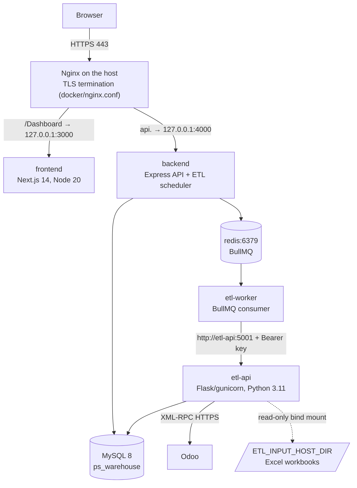

# Deployment Guide — Promotion Dashboard (BMH)

For the DevOps engineer. It supersedes the earlier one-page overview that was in this file; the VPS walkthrough
([`07ps-sales-dashboard-app/docs/vps-deployment.md`](../07ps-sales-dashboard-app/docs/vps-deployment.md)) is still valid for DNS/Nginx/TLS details.
The ETL itself (modes, schedule, timestamps, the refresh log) is in [ETL.md](ETL.md).
Paths are relative to `07ps-sales-dashboard-app/` (the "app folder", where `docker-compose.yml` lives) unless they start with `docs/`.
Statements that are not in the code are marked **ASSUMPTION** (listed in [§13](#13-assumptions)).

**Contents:** 1 Architecture & prerequisites · 2 Environment configuration · 3 Compose stack · 4 Database · 5 Build & CI · 6 Release & rollback ·
7 Checklists · 8 Post-deploy smoke check · 9 Monitoring & alerting · 10 Security · 11 Operations · 12 Known issues & open decisions · 13 Assumptions

---

## 1. Architecture and prerequisites



| Service | Image / runtime | Container port → host | Notes |
|---|---|---|---|
| `frontend` | `node:20-alpine`, Next.js (`basePath: /Dashboard`) | 3000 → `127.0.0.1:3000` | Build-time vars: `NEXT_PUBLIC_API_BASE_URL`, `NEXT_PUBLIC_APP_TIMEZONE` |
| `backend` | `node:20-alpine`, Express | 4000 → `127.0.0.1:4000` | Also runs the cron scheduler; **one replica only** |
| `etl-worker` | `node:20-alpine` | — | Consumes the queue; no port |
| `etl-api` | `python:3.11-slim`, gunicorn `-w 1` | 5001 → `127.0.0.1:5001` | Internal only; image ≈ 2.4 GB |
| `redis` | `redis:7-alpine` | 6379 → `127.0.0.1:6379` | Persisted in volume `redisdata` |
| MySQL | **not in compose** — an existing MySQL 8 (tested with `mysql:8.0.46`) | 3306 | Host DB or a separate server |
| `ingestion` | legacy | — | Moved to compose profile `legacy` (not started by default); see §12 |
| Nginx | on the host | 80, 443 | Config: `docker/nginx.conf` |

**Versions:** Node 20 LTS (`engines: >=20`), Python 3.11, MySQL 8.0 (uses `GET_LOCK`, `performance_schema`, utf8mb4), Redis 7, Docker Engine ≥ 24 with Compose v2 (tested locally with Engine 28.5.2).
**OS — ASSUMPTION:** Ubuntu 22.04/24.04 LTS (any Linux with Docker; the repository's earlier docs target a "Libyan Spider VPS" with root access).
**Sizing — ASSUMPTION** (no production measurement in the repository; verify with `docker stats`): 4 vCPU, 8 GB RAM, 60 GB disk (images ≈ 6.5 GB, Docker logs ≤ 1.25 GB per service worst case, DB dumps, Redis, ETL output). etl-api needs the most memory (pandas).
**Network / firewall:**

| From → To | Port | Rule |
|---|---|---|
| Internet → host | 80, 443 | Allow (80 only redirects / ACME) |
| Internet → host | 3000, 4000, 5001, 6379 | **Deny** (compose binds them to 127.0.0.1) |
| host → MySQL | 3306 | Allow from the Docker host/bridge to the DB; **not** from the internet |
| host → Odoo | 443 | Allow outbound to `ODOO_URL` |
| host → SMTP | 587 (or your provider's) | Allow outbound (password-reset mail) |
| host → NTP | 123/udp | Allow — clocks on the app, DB and ETL hosts must agree (freshness check tolerance is 5 min) |

**DNS:** one A/AAAA record for the app domain and one for the API subdomain (`api.<domain>`), pointing at the host. **TLS:** Let's Encrypt via certbot (`/.well-known/acme-challenge/` is already routed in `nginx.conf`); TLS 1.2/1.3 only, HSTS on. The frontend calls the API as a **separate origin** (`NEXT_PUBLIC_API_BASE_URL`), so `FRONTEND_ORIGIN` (CORS) must be the exact browser origin.
**Domain caution:** `docker/nginx.conf` and the compose default use `benmussa-invest.com`, while `frontend/next.config.mjs` says the app is mounted at `bmh.com.ly/Dashboard` — see §12.

---

## 2. Environment configuration

There are four env files. `*.env.example` files are committed; real `.env` files are git-ignored and never committed. Per-environment templates: `deploy/config/staging/`, `deploy/config/production/` (dev = the plain `.env.example` files).

| File (real, on the server) | Template (dev) | Staging / production templates | Read by |
|---|---|---|---|
| `.env` (app folder) | `.env.example` | `deploy/config/<env>/project.env.example` | `docker compose` (host folders, timezone, image tag, DB host, build args) |
| `backend/.env` | `backend/.env.example` | `deploy/config/<env>/backend.env.example` | backend + etl-worker |
| `data/etl/.env` | `data/etl/.env.example` | `deploy/config/<env>/etl.env.example` | etl-api (+ the pipeline subprocess) |
| `frontend/.env.local` (dev only) | `frontend/.env.example` | — (build args come from `.env`) | Next.js dev server |

Values in `docker-compose.yml`'s `environment:` **override** the env files (so `DB_HOST`, `REDIS_HOST`, `ETL_API_URL`, `ETL_INPUT_DIR`, `TIMEZONE`, `TZ`, `ETL_SCHEDULE_TIMEZONE` cannot be broken by a stale line in an env file).

### 2.1 Project `.env` (compose)

| Variable | Purpose | Dev | Staging | Production |
|---|---|---|---|---|
| `APP_TIMEZONE` | One IANA zone: `TZ` of every container, backend `APP_TIMEZONE`, ETL `TIMEZONE`, cron zone, frontend `NEXT_PUBLIC_APP_TIMEZONE` | `Africa/Tripoli` | same | same |
| `IMAGE_TAG` | Tag of the `07ps/*` images | `local` | release tag | release tag (set by `scripts/deploy.sh`) |
| `DB_HOST_FOR_CONTAINERS` | DB host as seen from containers | `host.docker.internal` | DB hostname/IP | DB hostname/IP |
| `ETL_INPUT_HOST_DIR` | Host folder with the Excel inputs → mounted **read-only** at `/etl/input` | `./data/etl/input` or `C:/Users/you/Desktop/Input` (Docker Desktop) | `/srv/07ps/etl/input` | `/srv/07ps/etl/input` |
| `ETL_OUTPUT_HOST_DIR` | Optional host folder for ETL outputs (unset = named volume `etl_output`) | unset | unset | unset |
| `NEXT_PUBLIC_API_BASE_URL` | Browser → API base URL (**build arg**) | `http://localhost:4000` | `https://api-staging.<domain>` | `https://api.<domain>` |

### 2.2 `backend/.env` (backend and etl-worker)

| Variable | Purpose | Default | Dev | Staging | Production |
|---|---|---|---|---|---|
| `PORT` | API port | `4000` | `4000` | `4000` | `4000` |
| `NODE_ENV` | `production` → fail-fast when the DB is down, no dev shortcuts | — | `development` | `production` | `production` |
| `APP_TIMEZONE` | Business/display zone of naive `Fact_*` datetimes; **must equal the ETL `TIMEZONE`** | `Africa/Tripoli` | `Africa/Tripoli` | same | same |
| `REFRESH_CHECK_TOLERANCE_MINUTES` | Freshness-check tolerance | `5` | `5` | `5` | `5` |
| `REFRESH_STALE_AFTER_MINUTES` | Stale threshold | `270` | `270` | `270` | `270` |
| `DB_HOST` (overridden by compose), `DB_PORT` | MySQL | `localhost`, `3306` | `127.0.0.1` | CHANGE_ME | CHANGE_ME |
| `DB_USER` / `DB_PASSWORD` / `DB_NAME` | App account (`ps_app`, §4.3) — **secret** | `root`/``/`ps_warehouse` | dev account | CHANGE_ME | CHANGE_ME |
| `DB_SOCKET` | Unix socket (wins over host/port) | empty | empty | empty | empty |
| `JWT_SECRET` | Token signing key — **secret**; `openssl rand -base64 48`; different per environment | — | any | CHANGE_ME | CHANGE_ME |
| `FRONTEND_ORIGIN` | CORS allow-list (comma-separated) and reset-link base | `http://localhost:3000` | same | `https://staging.<domain>` | `https://<domain>` |
| `SMTP_HOST/PORT/SECURE/USER/PASSWORD/FROM` | Password-reset e-mail — **secret** | — | empty | CHANGE_ME | CHANGE_ME |
| `RATE_LIMIT_LOGIN_MAX`, `RATE_LIMIT_LOGIN_WINDOW_MIN`, `ACCOUNT_LOCK_THRESHOLD`, `PASSWORD_RESET_TOKEN_TTL_MIN` | Login hardening | `10`, `15`, `5`, `60` | same | same | same |
| `ETL_API_URL` (overridden by compose) | etl-api URL | `http://localhost:5001` | same | `http://etl-api:5001` | `http://etl-api:5001` |
| `ETL_API_KEY` | Shared secret with etl-api — **secret** (`openssl rand -base64 32`) | empty | any | CHANGE_ME | CHANGE_ME |
| `ETL_API_POLL_INTERVAL_MS` | Status polling | `1000` | | | |
| `ETL_LOG_DIR` (overridden by compose) | Orchestration log directory | `./logs/etl` | | `/var/log/07ps/etl` | `/var/log/07ps/etl` |
| `ETL_SCHEDULE_INCREMENTAL_CRON`/`_ENABLED`, `ETL_SCHEDULE_FULL_CRON`/`_ENABLED` | Schedules | `50 8,11,14,17,20 * * *` / `0 2 * * *`, `true` | `false` | **`false`** (avoid extra Odoo load) | `true` |
| `ETL_SCHEDULE_TIMEZONE` (overridden by compose) | Zone of the crons | server zone | | `APP_TIMEZONE` | `APP_TIMEZONE` |
| `REDIS_HOST` (overridden by compose), `REDIS_PORT` | Queue | `localhost`, `6379` | | `redis` | `redis` |

### 2.3 `data/etl/.env` (etl-api) — full reference in ETL.md §7.1

Required: `ODOO_URL`, `ODOO_DB`, `ODOO_USER`, `ODOO_API_KEY` (**secret**); `DB_USER`, `DB_PASSWORD` (**secret**, the ETL account `ps_etl`), `DB_NAME`; `ETL_API_KEY` (= backend's). Compose supplies `DB_HOST`, `TIMEZONE`, `DB_SESSION_TIMEZONE=+00:00`, `ETL_INPUT_DIR=/etl/input`, `ETL_OUTPUT_DIR=/etl/output`, `TZ`. Optional tuning: `BATCH_SIZE`, `DB_CHUNKSIZE`, `INCREMENTAL_OVERLAP_DAYS`, `DB_RELOAD_MODE`, `ODOO_TIMEOUT_SECONDS`, `ODOO_MAX_RETRIES`, `LOG_LEVEL`, `ETL_ALLOW_EMPTY_PRODUCT_MAPPING`.
Staging should use its **own** database and (preferably) an Odoo test/staging database or read-only production key with the schedules disabled.

### 2.4 Smoke-check variables (not in any `.env`; export them in the deploying shell or CI)

`BACKEND_URL`, `FRONTEND_URL`, `FRONTEND_PATH` (`/Dashboard`), `ETL_API_URL`, `ETL_API_KEY`, `SMOKE_ADMIN_EMAIL`, `SMOKE_ADMIN_PASSWORD` (a dedicated Admin account, stored in the CI secret store).

---

## 3. The compose stack

`docker-compose.yml` (validated with `docker compose config` and, for etl-api, built locally) provides:

* **Health checks:** redis `redis-cli ping`; etl-api `curl /health` (Dockerfile `HEALTHCHECK`); backend `GET /health` (200 only if DB **and** auth store are reachable; Redis down = "degraded" but still 200); frontend `GET /`; etl-worker `pgrep` of its node process. Start order: redis → etl-api/backend → frontend/etl-worker (`depends_on: condition: service_healthy`).
* **Restart policy:** `unless-stopped` on all services. In production the backend `exit(1)`s if the DB is unreachable at startup, so Docker crash-loops it visibly instead of serving 503s.
* **Resource limits** (`deploy.resources.limits`, honoured by Compose v2): redis 0.5 CPU/256 MB, etl-api 2 CPU/3 GB, backend 1 CPU/768 MB, frontend 1 CPU/768 MB, etl-worker 0.5 CPU/512 MB (**ASSUMPTION** — starting values; tune from `docker stats`).
* **Volumes:** named `redisdata` (queue state), `etl_output` (ETL outputs and `.pipeline_cache`; or a host folder via `ETL_OUTPUT_HOST_DIR`), `etl_logs` (orchestration `etl.log`, shared by backend and worker). The ETL input folder is a **read-only bind mount** (`${ETL_INPUT_HOST_DIR}:/etl/input:ro`). The database is external and persistent by definition.
* **Log rotation:** `json-file`, 50 MB × 5 per service (redis 50 MB × 5 too), plus `etl.log` (10 MB × 5) inside `etl_logs`.
* **Timezone:** `TZ=${APP_TIMEZONE}` on **every** service; `tzdata` installed in all images so it takes effect.
* **No hard-coded host paths:** every host folder is a variable; container-side paths are fixed. On Linux the `host.docker.internal:host-gateway` mapping is added for a DB on the Docker host.
* **Images:** each service is tagged `07ps/<service>:${IMAGE_TAG}` and built from the repository root context.
* **Not included** (deliberately): MySQL, Nginx/TLS (on the host — `docker/nginx.conf`), certbot.

Bring-up on a new host: create the three `.env` files (§2), put the Excel files in `ETL_INPUT_HOST_DIR`, apply the DB migrations/grants (§4), then `docker compose up -d --build` and run the smoke check (§8).

---

## 4. Database

### 4.1 Migrations

`data/warehouse/migrations/*.sql`, applied in filename order by `data/warehouse/apply_migrations.py` (needs `pip install pymysql cryptography`; env `DB_HOST/DB_PORT/DB_USER/DB_PASSWORD/DB_NAME` of an account with `CREATE`/`ALTER`/`INDEX`):

```bash
python3 data/warehouse/apply_migrations.py                       # every file — FRESH database only
python3 data/warehouse/apply_migrations.py 0022_etl_run_log.sql  # named file(s) only — use on an existing database
```

* **There is no applied-migrations tracking table**, and most files are plain `CREATE TABLE` (not re-runnable). On an **existing** database apply only the new file(s) by name. **This deployment adds exactly one: `0022_etl_run_log.sql`** — idempotent (`CREATE TABLE IF NOT EXISTS`), verified on MySQL 8.0.46 including a second run.
* On a **fresh** database migrations `0018`+ reference tables that the ETL itself creates (`Dim_Segment`, …), so a whole-folder run stops at `0018` until an ETL full run has created them (verified). Order for a fresh environment: `0001`–`0017` → first full ETL run → `0018`–`0022`. (Restoring a dump of production avoids this.)
* Files `0002_facts.sql`, `0003_target_plan_fact.sql`, `0004_calendar_and_metadata.sql`, `0005_customer_status_scd2.sql`, `0006_rbac_manifest.sql`, `0007_rls_policies.sql` are deprecated comment-only stubs.
* `scripts/deploy.sh` runs the migration step when `MIGRATION_ENV_FILE` points at an env file with an **admin** DB account (not `ps_app`/`ps_etl`).

### 4.2 `etl_run_log` and indexes

`etl_run_log` (columns and semantics: ETL.md §9.2) is created by migration `0022`; the pipeline also self-creates it if missing. **Backfill once** after applying it and *before the first new run*:

```bash
docker compose exec etl-api python /repo/data/etl/scripts/backfill_etl_run_log.py --dry-run
docker compose exec etl-api python /repo/data/etl/scripts/backfill_etl_run_log.py
```

Read-path indexes for the cascading filters (`backend/src/filters/optionsService.ts` joins `Fact_SalesLines` to `Dim_Date` and `DISTINCT`s the dimension keys) and the freshness check are created by the ETL **after every load** (`DatabaseExporter.ensure_query_indexes`, because a full load drops and recreates the tables and with them any index):

| Table | Index | Serves |
|---|---|---|
| `Fact_SalesLines` | `(DateKey)` | date-window join to `Dim_Date` |
| `Fact_SalesLines` | `(CompanyKey, SegmentKey, SalespersonKey, CustomerKey)` | `/filters/options` combinations and the per-dimension cascades |
| `Fact_SalesLines` | `(SalespersonKey)` | salesperson scope/lock joins |
| `Fact_Orders` | `(OrderDateTime)`, `(QuotationDate)` | `MAX()` in `/meta/refresh-status` and the run-log watermark |
| `etl_run_log` | `(status, finished_at_utc)`, `(started_at_utc)`, unique `(run_uid)` | last-success lookup |

(The incremental path additionally indexes `Fact_SalesLines.order_date` and `Fact_Orders.OrderDateTime` itself; the recommended raw-table indexes are in `data/etl/INCREMENTAL_SQL_MODE.md`.) Verify: `SHOW INDEX FROM Fact_SalesLines;`.

### 4.3 Accounts (least privilege) — `data/warehouse/grants/least_privilege.sql` (template, placeholders only)

| Account | Used by | Grants |
|---|---|---|
| `ps_app` | backend, etl-worker | `SELECT` on the schema; `INSERT/UPDATE/DELETE` on app-owned tables (auth, roles, admin, `etl_job_runs`, MARCOM…; generate the list with the query in the file); `SELECT` on `performance_schema.*` and (optional) `CONNECTION_ADMIN` for the Control Center's *Force reset* |
| `ps_etl` | etl-api | `SELECT, INSERT, UPDATE, DELETE, CREATE, DROP, ALTER, INDEX, LOCK TABLES` on the schema — required because full loads drop/recreate `Fact_*`/`Dim_*`/`raw_*`/`QA_*` (MySQL cannot grant DDL on not-yet-existing tables by pattern). It can therefore technically write app tables; for real isolation give the ETL its own schema. |
| `ps_backup` | `scripts/backup_db.sh` | `SELECT, SHOW VIEW, TRIGGER, LOCK TABLES, EVENT` + `PROCESS` |
| migration/admin | `apply_migrations.py` | `CREATE/ALTER/INDEX` — used by hand or by `deploy.sh`, never by the services |

Charset/collation is `utf8mb4` / `utf8mb4_unicode_ci` (Arabic text). The server's `default-time-zone` no longer matters: the backend pool and the ETL pin their sessions to UTC.

### 4.4 Backup and restore

```bash
# backup (option file mode 600 with [client] host/user/password of ps_backup; never on the command line)
BACKUP_DEFAULTS_FILE=/etc/07ps/backup.cnf DB_NAME=ps_warehouse scripts/backup_db.sh     # → db_backups/ps_warehouse-<UTC>.sql.gz, keeps 14 days
# restore (stop writers first)
docker compose stop etl-worker etl-api backend
gunzip -c db_backups/ps_warehouse-<UTC>.sql.gz | mysql --defaults-extra-file=/etc/07ps/backup.cnf ps_warehouse   # use an account with write rights
docker compose up -d
python3 scripts/post_deploy_check.py          # then a full ETL refresh if the dump is old
```

Schedule the backup daily (cron) and always before a deployment (`deploy.sh` does it unless `SKIP_BACKUP=1`); copy dumps off-host; test a restore into staging at least quarterly. The warehouse is **re-buildable** from Odoo + the Excel inputs (full refresh ≈ 17 min), but app tables (users, roles, admin data, MARCOM uploads) are **not** — they are the real reason to back up.

---

## 5. Build and CI

`.github/workflows/ci.yml` (repository root — the earlier copy inside the app folder could never be picked up by GitHub and used Postgres against MySQL migrations; both fixed):

| Job | Steps |
|---|---|
| `node` | `npm ci`, `format:check` and `lint` (non-blocking, see §12), backend `vitest` (incl. the refresh-status tests), `build` (frontend + backend) |
| `etl-python` | `pytest` for `data/etl/tests`, `data/etl/api/tests` (incl. `etl_run_log`, backfill, input checks) and `scripts/test_post_deploy_check.py` (product-dimension tests excluded: §12) |
| `ingestion-lint` | `ruff` + `black --check` (unchanged) |
| `sql` | MySQL 8 service; applies `0022_etl_run_log.sql` twice |
| `docker` | `docker compose config` with the example env files; `docker compose build` |

**Release (ASSUMPTION — no registry/CD credentials exist in the repository):** add a job on tag push `v*` that builds and pushes `07ps/{etl-api,backend,frontend,etl-worker}:<tag>` to your registry (e.g. GHCR), then SSH-runs `scripts/deploy.sh deploy <tag>` on the host with the secrets from the CI secret store. Until then `deploy.sh` builds on the host from the checked-out tag.
**Versioning:** semantic versions as git tags (`v1.4.0`); the image tag = the git tag (or short SHA for staging). `IMAGE_TAG` is the single source of truth on the host; `.deploy_state/current_tag` / `previous_tag` record what is deployed.

---

## 6. Release and rollback — exact commands

```bash
git fetch --tags && git checkout v1.4.0
export SMOKE_ADMIN_EMAIL=... SMOKE_ADMIN_PASSWORD=... ETL_API_KEY=...      # from the secret store, not a file in the repo
export MIGRATION_ENV_FILE=/etc/07ps/migrate.env MIGRATIONS="0022_etl_run_log.sql"   # optional; admin DB account
export BACKUP_DEFAULTS_FILE=/etc/07ps/backup.cnf
scripts/deploy.sh deploy v1.4.0        # backup → migrate → build/pull → up -d → wait healthy → smoke check (--run-etl)
scripts/deploy.sh status
scripts/deploy.sh rollback             # to .deploy_state/previous_tag   (or: rollback v1.3.2)
```

`deploy` automatically rolls back to the previous tag if the health wait or the smoke check fails (`AUTO_ROLLBACK=0` to disable). Rollback **reuses the images already on the host** (`07ps/<service>:<previous-tag>`; or pulls them if `IMAGE_REGISTRY` is set) and never rebuilds — so keep the last two release images (do not `docker image prune -a`), otherwise check out the old tag and `deploy` it. Rollback does **not** revert database migrations (they are additive; the old code ignores `etl_run_log`) and does not restore data — for data use §4.4. Manual equivalent:

```bash
IMAGE_TAG=v1.3.2 docker compose up -d --remove-orphans && python3 scripts/post_deploy_check.py
```

If only the frontend needs re-pointing (API URL/timezone are build-time): `docker compose build frontend && docker compose up -d frontend`.

---

## 7. Checklists

### 7.1 Pre-deploy

- [ ] CI green on the tag (all five jobs).
- [ ] `.env`, `backend/.env`, `data/etl/.env` exist on the host, are `chmod 600`, contain **no** `CHANGE_ME`, and `ETL_API_KEY` is identical in the last two.
- [ ] `APP_TIMEZONE` decided and set once (`Africa/Tripoli` unless told otherwise); `NEXT_PUBLIC_API_BASE_URL` is the real API URL.
- [ ] DB: accounts created from `least_privilege.sql`; fresh **backup** taken; migration `0022` applied (or `MIGRATION_ENV_FILE` set).
- [ ] The five Excel files are in `ETL_INPUT_HOST_DIR` with **exact case-sensitive names**, readable by the container user; `PRODUCTS.xlsx` first sheet has `OdooProductName` + `ProductName` filled.
- [ ] DNS + TLS certificates valid; Nginx config reloaded; firewall as §1.
- [ ] `docker compose config -q` passes; host clock is synced (`timedatectl`).
- [ ] Legacy log backfill done (once) — §4.2.
- [ ] A dedicated Admin account for the smoke check exists.
- [ ] Rollback tag known (`scripts/deploy.sh status`).

### 7.2 Post-deploy verification (all automated by the smoke script, run manually the first time)

- [ ] `docker compose ps` → all `healthy`.
- [ ] `python3 scripts/post_deploy_check.py --run-etl` → `N/N checks passed` (health endpoints, DB, Redis queue, ETL preflight with input files found and product mappings > 0, admin login + role, filter options, one incremental ETL run **success**, refresh log **consistent** and Last Refresh advanced).
- [ ] Open the dashboard in a browser: no red banner; footer *Last Refresh* shows the just-finished run in Libya time.
- [ ] `SELECT status, finished_at_utc, watermark_order_created_utc FROM etl_run_log ORDER BY run_id DESC LIMIT 3;` shows a `success` row with a watermark.
- [ ] `docker compose logs --tail=100 backend etl-api` free of errors; no restart loops (`docker compose ps` restart counts).
- [ ] Scheduler registered: `docker compose logs backend | grep "Registered incremental ETL schedule"`; Control Center shows *Next Incremental Refresh*.
- [ ] Alerts firing tests done once (stop `etl-worker`, see the alert, start it).

---

## 8. Post-deploy smoke check — `scripts/post_deploy_check.py`

Standard-library Python 3 (works on the host, in CI, and on Windows). Exit code 1 (deployment fails) if any check fails. Order and what each proves:

| # | Check | Passes when |
|---|---|---|
| 1 | Backend `/health` | reachable; `database`, `authStore`, `etlQueue` (Redis) all `ok` |
| 2 | Frontend `${FRONTEND_URL}${FRONTEND_PATH}` | HTTP < 400 |
| 3 | ETL API `/health`, `/etl/preflight` | input files found and valid, output dir writable, **`productMappings.count > 0`** |
| 4 | Admin login, `/auth/me`, `/admin/etl/status` | credentials valid; account has the Admin role |
| 5 | `/filters/options` | 200 with non-empty option groups |
| 6 | `--run-etl`: `POST /admin/etl/start/incremental`, poll `/admin/etl/status` | run reaches `success` within `--etl-timeout` (default 3600 s) |
| 7 | `/meta/refresh-status` | **`refreshCheck.status == "ok"`** (not `inconsistent`, not `no_refresh_log`); with `--run-etl`, `lastRefreshTime` ≥ script start |

**Local results (this preparation, 2026-09-20):** `python -m pytest scripts/test_post_deploy_check.py` → **11 passed** against a stub of the backend/frontend/ETL API (all green, stale refresh after an ETL run fails, inconsistent log fails with the specific message, zero product mappings fail, Redis down fails, failed ETL run fails, bad login skips dependents, unreachable backend is a failed check not a crash, CLI exit codes). It was **not** run against the real stack (no Odoo/production data here) — see the report at the end of the hand-off.

---

## 9. Monitoring and alerting

* **Endpoints:** backend `GET /health` (200/503, JSON dependencies), etl-api `GET /health`, frontend `GET /Dashboard`; container health via `docker compose ps` / `docker inspect`. Each has a Docker `HEALTHCHECK`.
* **Uptime checks (external):** HTTPS 200 on `https://<domain>/Dashboard` and `https://api.<domain>/health` every 1 min (UptimeRobot/Better Stack/Zabbix/your monitor), alert on 2 consecutive failures; TLS expiry < 14 days.
* **Log aggregation:** Docker `json-file` logs (rotated) → ship with the Docker/Promtail/Filebeat driver of your choice; parse the pipeline's `... +0200 | LEVEL | logger | message` format and the backend's `YYYY-MM-DD HH:mm:ss | LEVEL | message`. Alert on `ERROR` from `etl-api`, `Pipeline failed`, `Unhandled promise rejection`, `[startup] FAIL`. `etl.log` lives in the `etl_logs` volume.
* **ETL alerts** (definitions and queries: ETL.md §10): failed run (page); run longer than 45 min (warn); no successful run in 6 h (page); stale watermark (warn); inconsistent refresh log (warn — the smoke script or a 15-min cron of it with `--skip-etl-api`); Redis/worker down (page).
* **Host:** disk > 80 %, memory, container restarts > 3/h, `docker system df`, NTP offset > 1 s (the freshness check tolerates 5 min).
* **Database:** connections, slow queries, replication/backup age, free space; the lock `sales_pipeline_full_load` held > 45 min (`SELECT IS_USED_LOCK('sales_pipeline_full_load')`).
* The routing point for alerts (Teams/Slack/e-mail/on-call) is an open decision (§12).

---

## 10. Security checklist

- [ ] **Secrets:** real values only in server-side `.env` files (`chmod 600`, owner = deploy user) or a secret manager; `git check-ignore -v backend/.env data/etl/.env .env` matches; nothing real in git history (the repo's `docs/archive/` may hold old notes — rotate anything that was ever pasted there). Rotate `JWT_SECRET`, `ETL_API_KEY`, DB, Odoo and SMTP secrets before go-live and after any staff change.
- [ ] **HTTPS everywhere:** Nginx redirects 80→443, HSTS on, TLS 1.2+; `NEXT_PUBLIC_API_BASE_URL` and `FRONTEND_ORIGIN` are `https://`.
- [ ] **CORS:** `FRONTEND_ORIGIN` is the exact production origin (no `*`); the API allow-list is read from it (`server.ts`).
- [ ] **Admin-only routes:** `/admin/etl/*` require the Admin role; other `/admin/*` use page permissions; verify with a non-admin account (expect 403).
- [ ] **Network exposure:** only 80/443 are public; `127.0.0.1` bindings kept for 3000/4000/5001/6379; etl-api not proxied.
- [ ] **No debug mode:** `NODE_ENV=production`; `FLASK_ENV=production` (gunicorn, not `app.run`); `LOG_LEVEL=INFO`; the demo seed refuses to run under `NODE_ENV=production`.
- [ ] **Dependency audit:** `npm audit --omit=dev` (root) and `pip install pip-audit && pip-audit -r data/etl/requirements.txt` in CI or before each release; pin/upgrade high/critical findings; rebuild images on base-image security updates.
- [ ] **Auth hardening:** login rate limit and account lockout set (`RATE_LIMIT_LOGIN_*`, `ACCOUNT_LOCK_THRESHOLD`); default/seed admin password changed; SMTP credentials scoped.
- [ ] **DB:** application, ETL, backup and migration accounts are separate (§4.3); MySQL reachable only from the Docker host; TLS to a remote DB if it is not on the same host.
- [ ] **Input folder:** read-only mount; write access limited to the workbook owners; no credentials stored in it.
- [ ] **Containers:** images pinned by tag; consider `read_only: true`/non-root users (the Node images run as root today — see §12).
- [ ] **Backups** encrypted at rest/off-host; restore tested.

---

## 11. Operations

| Routine | How |
|---|---|
| Status / logs | `docker compose ps` · `docker compose logs -f --tail=200 <service>` |
| Restart | `docker compose restart <service>` (env-file changes need `docker compose up -d <service>` to recreate) |
| Update Excel inputs | replace the file in `ETL_INPUT_HOST_DIR` (exact name, closed in Excel) → Control Center → *Preflight* → *Start Incremental*; product/mapping changes may need *Full* |
| Clear caches | ETL reference cache: `docker compose exec etl-api sh -c 'rm -rf /etl/output/.pipeline_cache'` (rebuilt on the next run, +8 s). Dashboard/API caches are in-memory (filter options: a few minutes) — `docker compose restart backend` clears them. Browser: hard refresh after a frontend rebuild |
| Change schedule | edit `ETL_SCHEDULE_*` in `backend/.env` → `docker compose up -d backend` |
| Rotate secrets | update the store → `.env` file → `docker compose up -d` the affected services → smoke check |
| Backup / restore | §4.4 |
| Run the ETL by hand | ETL.md §15 |
| Disk clean-up | `docker image prune -f` (keep the last two tags for rollback), old `db_backups/` are pruned by the script |

**Incident checklist:** (1) *Is it up?* uptime + `docker compose ps` + `/health`. (2) *Is it the data or the app?* the dashboard footer and `etl_run_log` (`SELECT … ORDER BY run_id DESC LIMIT 10`). (3) *Recent change?* `scripts/deploy.sh status`, `git log`. (4) *Stop the bleeding:* roll back (`deploy.sh rollback`) or stop the ETL (`docker compose stop etl-worker`) if data is being corrupted. (5) *Collect:* `docker compose logs --since 1h`, run id and error text from Admin → ETL Runs, the refresh-check message. (6) *Communicate* per the template below. (7) *After:* root cause, fix, add a test/alert, update this document.

**Contacts and escalation (fill in):**

| Role | Name | Phone | E-mail | Hours |
|---|---|---|---|---|
| L1 on-call (DevOps) | _TBD_ | _TBD_ | _TBD_ | _TBD_ |
| L2 developer (ETL/backend) | _TBD_ | | | |
| Business owner of the dashboard | _TBD_ | | | |
| Odoo administrator | _TBD_ | | | |
| DB / hosting provider support | _TBD_ | | | |
| Escalation rule | L1 ack ≤ 15 min → L2 after 30 min → business owner if data is wrong > 2 h | | | |

---

## 12. Known issues and open decisions

### 12.1 Decisions needed from you

| # | Decision | Why it matters / current state |
|---|---|---|
| 1 | **Hosting target** | Existing docs say a "Libyan Spider VPS"; nothing in the repository proves it is final. Sizing and OS in §1 assume a single Linux Docker host. |
| 2 | **DB host** | MySQL is external. Same host as Docker (`host.docker.internal`) or a separate server? Determines `DB_HOST_FOR_CONTAINERS`, firewall and TLS-to-DB. |
| 3 | **Domain and URL layout** | `nginx.conf`/compose default: `benmussa-invest.com` + `api.benmussa-invest.com`; `next.config.mjs` comment: `bmh.com.ly/Dashboard`. Pick one; it drives `FRONTEND_ORIGIN`, `NEXT_PUBLIC_API_BASE_URL`, certificates, Nginx `server_name`. |
| 4 | **Schedule** | Defaults: incremental `50 8,11,14,17,20 * * *`, full `0 2 * * *` (Tripoli time). Confirm against business hours and the downstream refresh times; note the nightly full refresh makes tables briefly unavailable (ETL.md §12). |
| 5 | **Timezone** | `Africa/Tripoli` (UTC+2, no DST) assumed everywhere. Changing it later requires a full refresh (business datetimes are stored in it). |
| 6 | **Owners of the Excel files** and update procedure | Not in the code (ETL.md §3.3). Also: who may write to `ETL_INPUT_HOST_DIR`, and how files reach the server (SFTP, shared folder, sync tool)? |
| 7 | **Alert routing and on-call** (§9, §11) | Channels and people are unassigned. |
| 8 | **Container registry / CD** (§5) | None configured; decide GHCR/Docker Hub/private and where the deploy runs. |
| 9 | **Legacy `ingestion` service** | It was part of the default compose; now behind `profiles: [legacy]`. Confirm it is retired (it is a mocked-Odoo ingestion path). If it must run, `docker compose --profile legacy up -d`. A stack already running from the old compose will drop it on `up --remove-orphans` — decide first. |
| 10 | **Staging** | Own database and Odoo test/read-only credentials? Schedules default to disabled there. |
| 11 | **Where migrations run** | By hand, by `deploy.sh` with an admin account, or in CI — no migration tracking table exists. |

### 12.2 Known issues (not fixed by this work unless stated)

1. **Full-refresh downtime and no atomic swap** (ETL.md §12): during the nightly full load (~6 min) queries can hit missing/partial tables. Recommended fix: load into `_new` tables and `RENAME TABLE`. *Not implemented.*
2. **`tests/test_product_dimension.py` fails on `main`** (5 tests: expectations about `Dim_Product` columns `ProductNameRaw`/`OdooProductID`/`ProductSource` and a separate `QA_UnmappedProducts` workbook no longer match the code) — pre-existing, unrelated to this work, excluded from CI with a comment. `tests/test_input_check.py::test_wrong_case_file_name_gets_a_near_match_hint` fails **only on Windows/macOS** (case-insensitive file system); it passes on Linux CI.
3. **Migrations `0018`+ cannot run on an empty database** (they need ETL-created tables) and there is no applied-migration ledger (§4.1).
4. **Node containers run as root** and are not `read_only`; `etl-api` image is ≈ 2.4 GB (pandas/scientific stack, `gcc` left in the image).
5. **Flask job state is in memory**: restarting `etl-api` mid-run loses the live log (the durable record is MySQL/Redis) and kills the run.
6. **Node ETL log timestamps have no UTC offset** (`etl.log` is in the container's `TZ`); Python logs do.
7. **Backfilled history**: legacy rows get `mode=unknown`/no created-at watermark when no audit row matches; the check then skips the watermark comparison for them (by design).
8. **`Fact_Orders.QuotationDate` exists only when `Fact_Sales` has rows.** The check treats a missing column as "created-at unknown" (fixed here; previously it made `/meta/refresh-status` fail).
9. **`etl_job_runs` display times were 2 h early** (parsed as Libya time although stored in UTC) — **fixed here** (`etlRunTracker.ts`).
10. `docker-compose.yml`'s old `version:` key was removed (obsolete in Compose v2).
11. `data/etl/.env.example`/`backend/.env.example` and several ETL docs (`README`, `docs/AUTOMATION.md`) still describe the old Windows Task Scheduler era in places.
12. **CI `format:check` and `lint` fail on `main`** independent of this work (Prettier `printWidth: 100` vs. existing long lines; 72 ESLint errors from a config that references an unknown `import/first` rule and lacks `NodeJS` globals). Both are `continue-on-error` in CI until fixed — the other jobs are blocking.
13. The repository has two `docs/` folders (repo root and app); this guide and ETL.md live in the root one, older runbooks in `07ps-sales-dashboard-app/docs/`.

---

## 13. Assumptions

1. Linux Docker host, Ubuntu LTS; single host for all containers; sizing (4 vCPU / 8 GB / 60 GB) and per-container limits are starting values without measurement.
2. Registry/CD not provided; `deploy.sh` builds on the host unless `IMAGE_REGISTRY` is set. The example deployment folder is `/srv/07ps`.
3. Domains in the templates are placeholders (`example.com`); the real domain is open decision 3.
4. The backup account/option file and the migration env file are created by you (`/etc/07ps/*.cnf|env` are placeholder paths).
5. Owners of the Excel files, alert thresholds, on-call contacts are unknown and marked TBD.
6. `ps_app` needs DML on all app-owned tables; the exact table list should be generated on the target database (query in the grants file).
